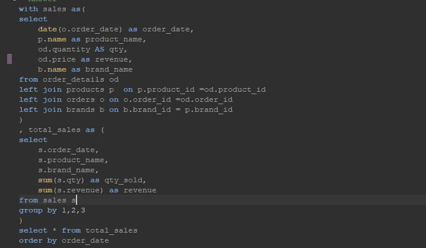
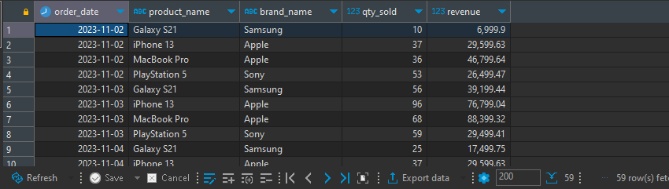

# Task 2

1.  Jalankan Docker compose
2.  Koneksikan postgre dengan dbeaver sesuai konfigurasi yang terdapat pada file docker compose
3.  Jalankan query berikut:

    
4. Berikut Hasil after run query diatas 

    

## END