# TASK 3
## 1. Membuat Folder Kosong `dbt-task3`
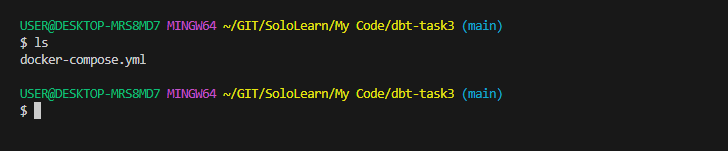

## 2. Menjalankan Docker Compose
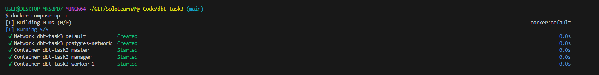

Pastikan Semua container berjalan

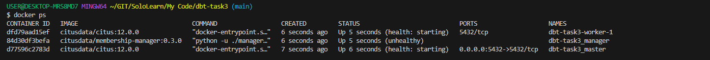

## 3. Koneksikan Postgre 
Sesuaikan dengan konfigurasi di file docker compose untuk melakukan koneksi

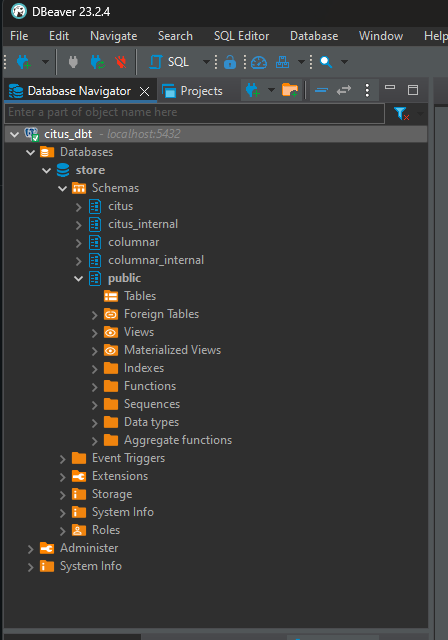

## 4. Setup VENV and Install DBT
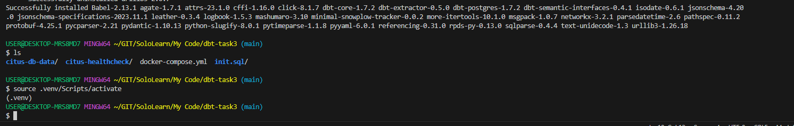

## 5. Create Requirement.txt
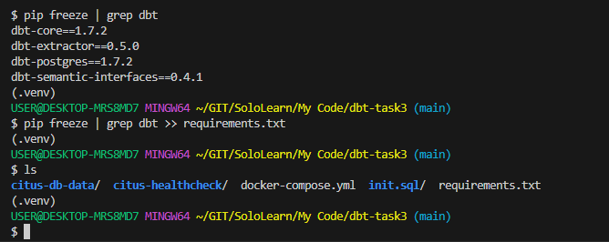

## 6. Setup DBT Profile
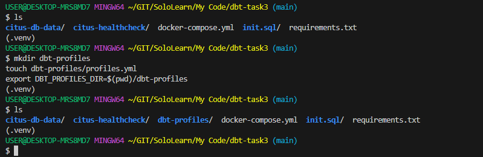

Lakukan Setup pada file `~/.dbt/profiles.yml`

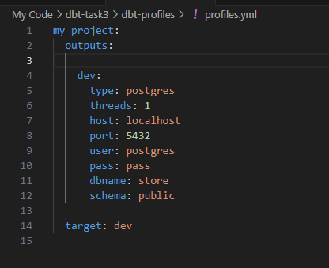

## 7. Setup DBT project
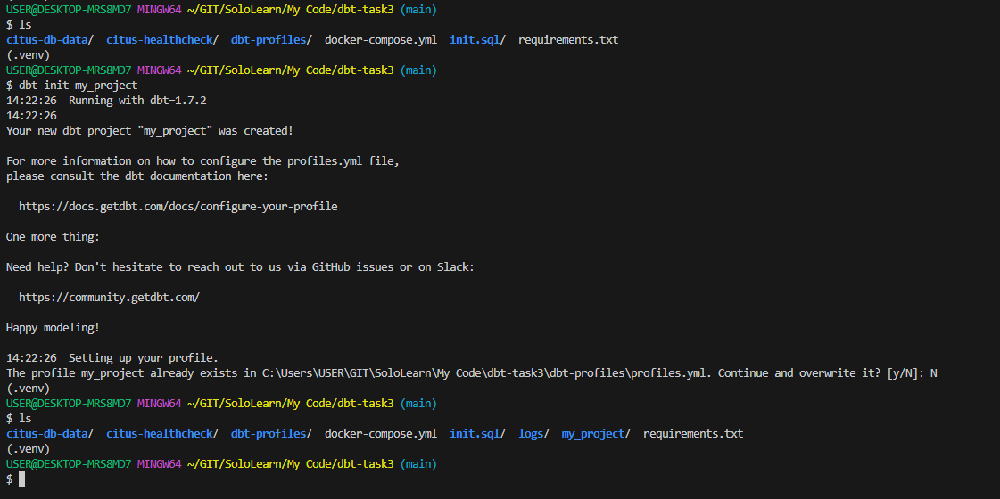

## 8. Setup DBT Project configuration
Lakukan setup pada file `my_project/dbt_project.yml`

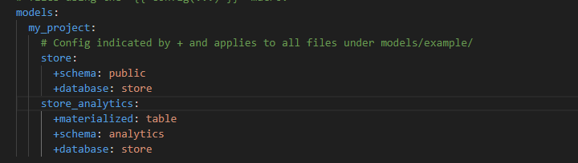

## 9. Defining Source
Definisikan Sumber data dalam file `models/store/schema.yml` dan  untuk menjalankan test nantinya sehingga bisa mendapatkan kualitas data yang terbaik yang kita inginkan.

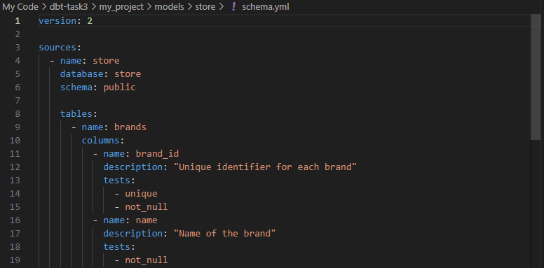

## 10. Creating a Model
Selanjutnya kita perlu mendefinisikan skema model yang akan kita buat pada file `models/store_analytics/schema.yml` dan definisikan bentuk tabel dari model ini pada file `models/store_analytics/daily_sales.sql`

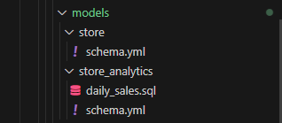

## 11. Run and test your model
Sebelum kita menjalankan run dan test model, pastikan database source yang kita buat sudah ada isinya, jadi kita perlu menjalankan sql kode seperti pada file init.sql

**Sebelum diisi tampak table masih kosong**

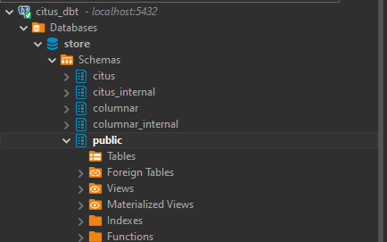

**After run query** based on init.sql file

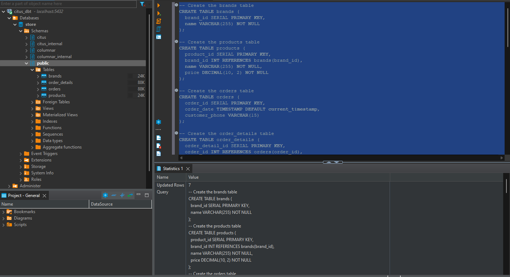

Kemudian masuk ke directory my_project dahulu, kemudian jalankan dbt run dan dbt test

**DBT RUN**

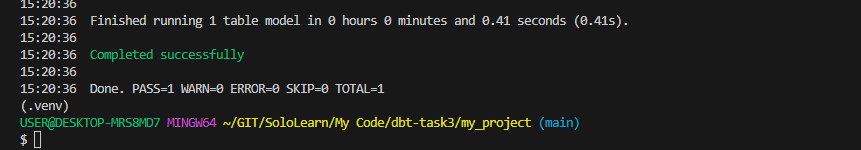

**DBT TEST**

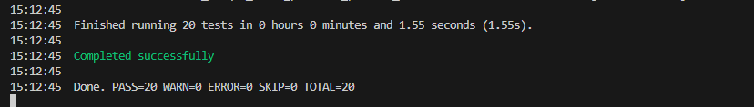

## 12. Check the result
Pertama kita akan cek apakah skema baru yang telah kita definisikan terbentuk

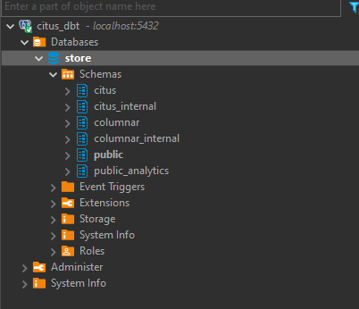

Kemudian cek isi tabel pada skema baru tersebut (public_analytics)

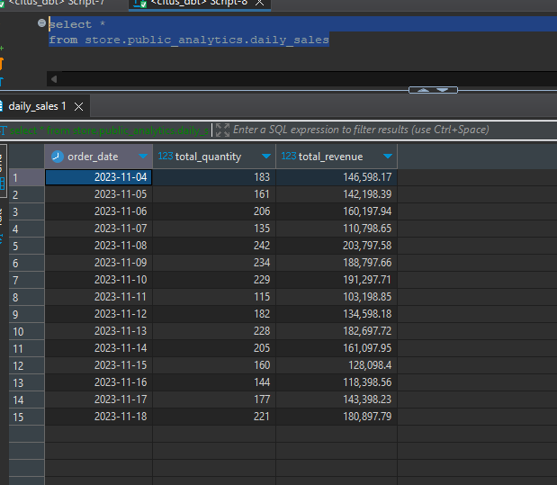

## END