# TASK 4

**set dbt_profiles**

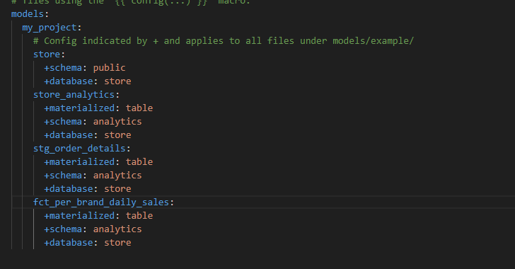

**Build packages.yml**

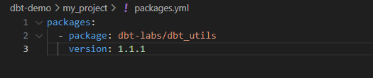

**set folder and make query and schema**

`schema 1`

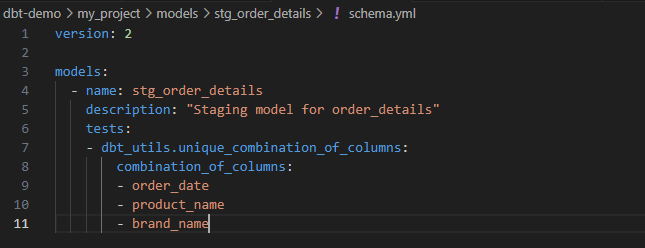

`query file 1`

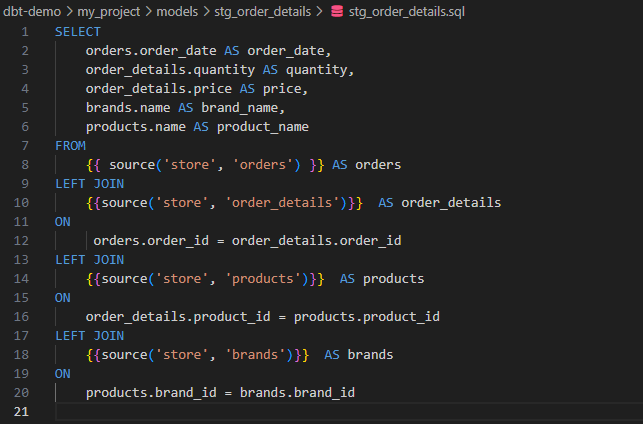

`schema 2`

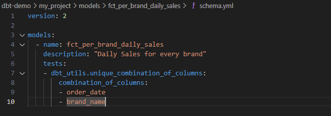

`query file 2`

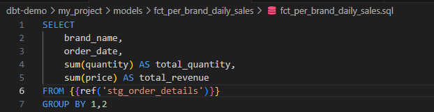

Jalankan dpt deps dahulu agar `packages.yml` yang kita buat bisa digunakan

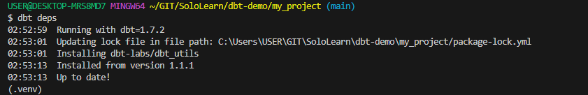

Setelah Kita membuat definisi model dan skemanya, kita bisa melakukan run dan test model.

**Before run dbt**

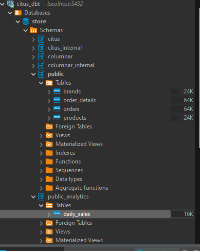

**After run dbt**

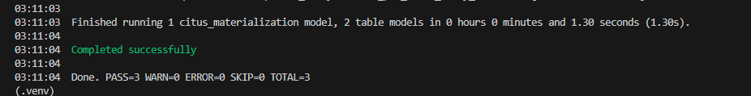

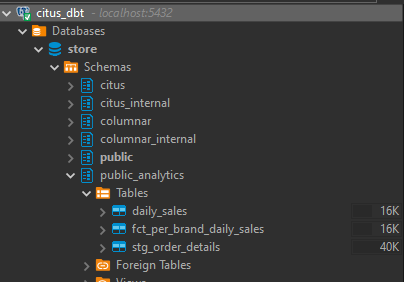

**Tests Result**

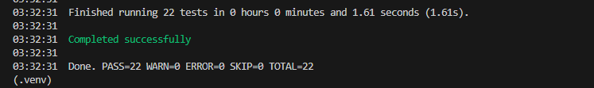

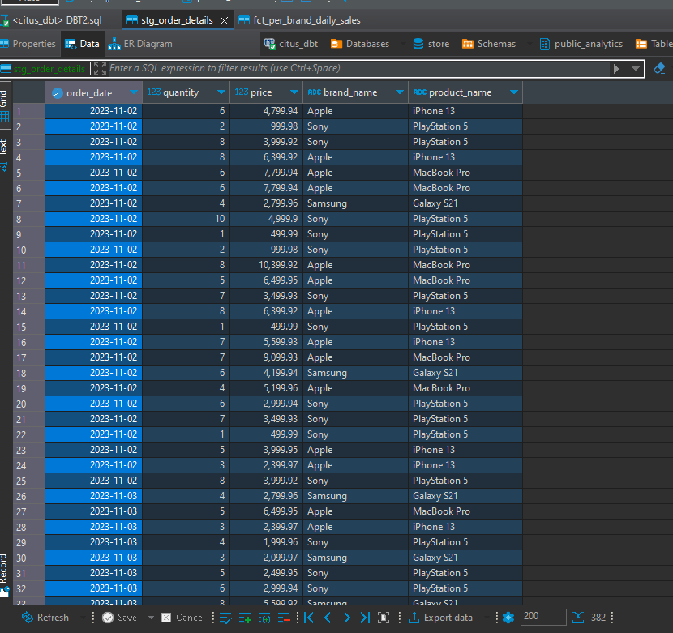

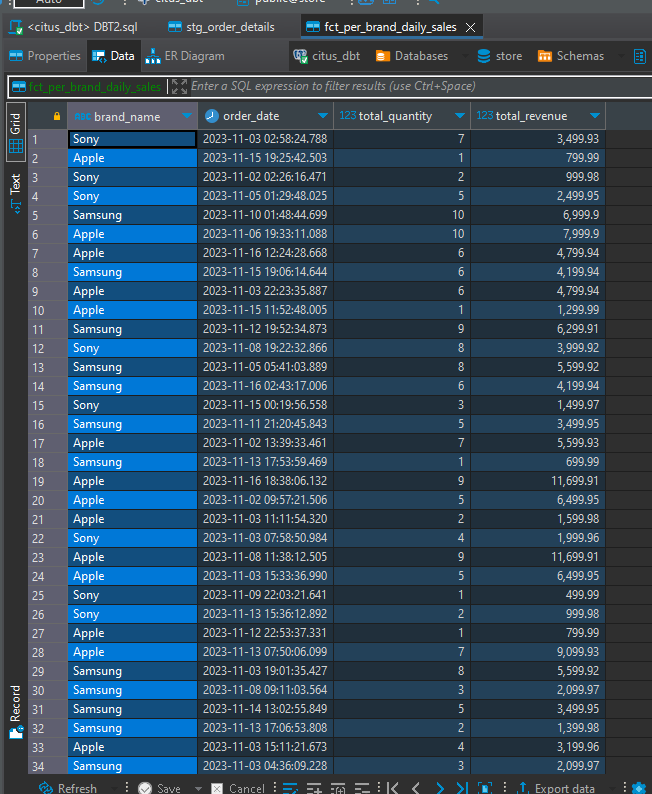

## END

