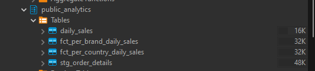

# TASK 5
## Ans 1
**Create macro folder and file** 

`macro 1 - normalized phone`

`macro 2 - country`

`update on sql stg_order_details`

**DBT RUN**

`Before run`

`After run`

`check`

## Ans 2
**Create model and add schema** 

`model`

`schema`

**Result** 

`before`

`after`

## END

